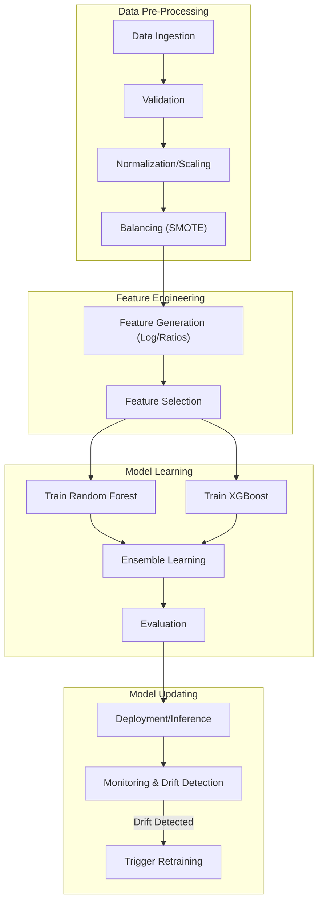

# Credit Card Fraud Detection System (MLOps Enhanced)

[](https://bibhavcodeverse-mlops-creditcard-fraud-detection-srcapp-a517fp.streamlit.app/#credit-card-fraud-detection-ml-ops)

** Live Dashboard:** [View MLOps Dashboard](https://bibhavcodeverse-mlops-creditcard-fraud-detection-srcapp-a517fp.streamlit.app/#credit-card-fraud-detection-ml-ops)


---

## Project Overview
This project implements an end-to-end Machine Learning pipeline to detect fraudulent credit card transactions. It addresses the significant class imbalance challenge (frauds account for only **0.172%**) using advanced techniques like SMOTE and Ensemble Learning.

Key Features of this Solution:

* **Robust Data Handling:** Implements **SMOTE** (Synthetic Minority Over-sampling Technique) to handle extreme class imbalance.
* **Targeted Feature Engineering:** Adds domain-specific features to capture spending patterns and anomalies.
* **Strict Feature Selection:** Uses Random Forest importance to select the top ~24 most predictive features, reducing noise.
* **Random Forest Strategy:** Trains a parallelized ensemble of 100 deep trees (n_jobs=-1, max_depth=20) to capture complex non-linear fraud patterns while maintaining generalization.
* **XGBoost Strategy:** Leverages gradient boosting with optimized step size (learning_rate=0.1) and depth (max_depth=6) to sequentially correct errors and maximize predictive accuracy.
* **Ensemble Learning:** Combines **Random Forest** and **XGBoost** via a Soft Voting Classifier to maximize detection capability.
* **Production-Ready Structure:** Organized code into modular scripts for data processing, training, evaluation, and inference.
* **Ensemble Learning with tuning hyperparameter:** experimentation lab designed to automatically find the best hyperparameters for Random Forest and XGBoost models using the dataset.

---

## MLOps Architecture



---

## Project Structure

```
credit-card-fraud-ml/
├── data/
│   ├── raw/                  # Original input file (creditcard.csv)
│   ├── processed/            # Generated files (train.csv, test.csv)
│
├── src/
│   ├── data_ingest.py        # [MLOps] 1. Loads, validates, and splits data
│   ├── feature_engineering.py# [MLOps] 2. Reusable Feature Engineering class
│   ├── train_pipeline.py     # [MLOps] 3. Orchestrates training (FE -> SMOTE -> Train)
│   ├── inference.py          # [MLOps] 4. FastAPI application for prediction
│   ├── monitoring.py         # [MLOps] 5. Drift detection (KS Test)
│   ├── retrain.py            # [MLOps] 6. Triggers retraining pipeline
│   ├── feature_selection.py      # [Legacy] Data Pipeline: Loading, Engineering, SMOTE, Saving
│   ├── train_random_forest.py    # [Legacy] Model Training: Random Forest
│   ├── train_xgboost.py          # [Legacy] Model Training: XGBoost
│   ├── train_ensemble.py         # [Legacy] Model Training: Voting Ensemble
│   ├── test_pipeline.py          # [Legacy] Inference: Loads models & predicts on test set
│   └── generate_visualizations.py# Analysis: Generates Confusion Matrices & PR Curves
│
├── models/                   # Saved Models (.pkl files)
├── metrics/                  # Evaluation metrics (evaluation.json)
├── plots/                    # Generated Charts (CM, ROC, PR Curves)
├── requirements.txt          # Python Dependencies
└── README.md                 # Project Documentation
```

---

## Installation & Usage

### Prerequisites
*   Python 3.8+
*   Pip

### 1. Install Dependencies
```bash
pip install -r requirements.txt
```

---

### Option A: Automated MLOps Pipeline (Recommended)
**Best for:** Production-ready workflow, automation, and real-time inference.

#### 1. Data Ingestion
Loads raw data, performs validation, and splits into train/test sets.
```bash
python src/data_ingest.py
```

#### 2. Train Pipeline
Runs the complete training flow: Feature Engineering -> SMOTE -> Model Tuning -> Ensemble Training.
```bash
python src/train_pipeline.py
```
*Artifacts saved:* `models/model.pkl`, `models/feature_engineer.pkl`, `metrics/evaluation.json`

#### 3. Run Inference API
Start the real-time prediction server.
```bash
uvicorn src.inference:app --reload
```
Test with curl or Python:
```bash
curl -X POST "http://localhost:8000/predict" -H "Content-Type: application/json" -d '[{"Time": 0, "Amount": 100.0, ...}]'
```

#### 4. Monitor & Retrain
Check for data drift against the training baseline.
```bash
python src/monitoring.py
```
Trigger retraining manually (or via automation script).
```bash
python src/retrain.py
```

---

### Option B: Step-by-Step Manual Execution
**Best for:** Debugging individual models, educational purposes, or granular control.

#### 1. Data Preparation
Run this script first. It performs feature engineering, selection, splitting, and SMOTE balancing.
```bash
python src/feature_selection.py
```
*Output: Saves processed CSVs to data/processed/.*

#### 2. Train Models
Train the models individually. Each script saves the trained model to `models/` and a metrics report to `metrics/`.

```bash
# Train Random Forest
python src/train_random_forest.py

# Train XGBoost
python src/train_xgboost.py

# Train Ensemble (Best of both worlds)
python src/train_ensemble.py

# Train model_tuning (Hyperparameter Optimization Lab)
python src/model_tuning.py
```

#### 3. Evaluate & Visualize
Generate Confusion Matrices and Precision-Recall Curves to visually assess performance.
```bash
python src/generate_visualizations.py
```
*Output: Images saved to plots/.*

#### 4. Running Inference (Testing)
To see the models in action on the test set (simulating a production environment):
```bash
python src/test_pipeline.py
```

---

## Methodology & Technical Details

### 1. Feature Engineering
We engineered specific features to capture fraud patterns:
| Feature Name | Description | Logic / Formula |
| :--- | :--- | :--- |
| **`log_amount`** | Normalizes skewness | `log(Amount + 1)` |
| **`amount_zscore`** | Outlier detection | `(Amount - Mean) / StdDev` |
| **`is_high_amount`** | High-value flag | `1` if Amount > 95th Percentile |
| **`amount_per_time`** | Velocity check | `Amount / (Time + 1)` |

### 2. Feature Selection
We trained a preliminary Random Forest to rank feature importance. To improve model generalization, we kept only the **Top 24 Features**, including our new engineered features and the most relevant PCA components (e.g., V17, V14, V12), discarding noise.

### 3. Handling Imbalance (SMOTE)
*   **Strategy:** Applied **SMOTE** to create synthetic examples of fraud.
*   **Crucial Detail:** SMOTE was applied **ONLY to the Training Set**. The Test Set remains imbalanced to ensure realistic evaluation.

#### Model Comparison (Minority Class – 1)

| Metric (Class 1 – Minority) | Unbalanced Dataset | Balanced Dataset | Why Balanced Dataset Is More Suitable |
| :--- | :--- | :--- | :--- |
| **Precision** | 0.96 | 0.79 | Slightly lower precision is acceptable to improve overall detection of minority cases |
| **Recall** | 0.74 | **0.86** | Higher recall ensures more true minority cases are correctly identified |
| **F1-score** | **0.84** | 0.82 | Balanced model maintains competitive F1 while improving recall |
| **ROC-AUC** | 0.95 | **0.98** | Better class separability and stronger generalization |
| **False Negatives (FN)** | 25 | **14** | Fewer missed positive cases, critical for risk-sensitive applications |
| **False Positives (FP)** | 3 | 22 | Increase in false positives is a trade-off for higher recall and safety |

#### Unbalanced vs Balanced Dataset – Pros & Cons

| Dataset Type | Category | Description |
| :--- | :--- | :--- |
| **Unbalanced Dataset** | **Pros** | • Very high precision (0.96) - highly accurate minority predictions<br>• Low false positives (3) - fewer false alarms<br>• Good ROC-AUC (0.95) - reasonable separability |
| | **Cons** | • Low recall (0.74) - misses many fraud cases<br>• High false negatives (25) - risky for fraud detection<br>• Biased toward majority class |
| | **Risk** | Model appears strong but silently ignores a significant portion of minority cases |
| **Balanced Dataset** | **Pros** | • **High recall (0.86)** - catches more fraud<br>• **Reduced false negatives (14)** - more reliable<br>• Excellent ROC-AUC (0.98) - strong ranking |
| | **Cons** | • Lower precision (0.79) - more false alarms<br>• Higher false positives (22) - increased verification cost |
| | **Trade-off** | **Model prioritizes sensitivity and safety over strict precision** |

### 4. Random Forest Configuration
**Random Forest Strategy:** Trains a parallelized ensemble of 100 deep trees (`n_jobs=-1`, `max_depth=20`) to capture complex non-linear fraud patterns while maintaining generalization.

### 5. XGBoost Configuration
**XGBoost Strategy:** Leverages gradient boosting with optimized step size (`learning_rate=0.1`) and depth (`max_depth=6`) to sequentially correct errors and maximize predictive accuracy.

The balanced dataset model is preferred for real-world imbalanced classification problems as it significantly improves recall and reduces false negatives, making it safer and more reliable despite a moderate increase in false positives.

---

## Model Performance
We optimized for **Recall** (catching as many frauds as possible) while maintaining decent Precision.

| Model | Recall | Precision | F1-Score | ROC-AUC |
| :--- | :--- | :--- | :--- | :--- |
| **Random Forest** | **85.71%** | **79.25%** | **0.82** | **0.982** |
| **XGBoost** | 85.71% | 42.25% | 0.57 | 0.976 |
| **Ensemble** | 85.71% | 72.41% | 0.79 | 0.983 |

## Confusion Matrix plots

**Ensemble_Learning:** 
**Random Forest:** 
**XGBoost:** 

## PR Curve Comparison


## Conclusion:
*   **Random Forest** is the best performing single model for this dataset configuration.
*   All models achieved excellent Recall (~86%), meaning they detect the vast majority of fraud attempts.
*   The **Ensemble model** provides a robust alternative, offering slightly higher ROC-AUC stability.

# 


---

## Dependencies
*   `pandas`, `numpy`: Data Manipulation
*   `scikit-learn`: Modeling & Metrics
*   `xgboost`: Gradient Boosting Model
*   `imbalanced-learn`: SMOTE Implementation
*   `joblib`: Model Persistence
*   `matplotlib`, `seaborn`: Visualization
